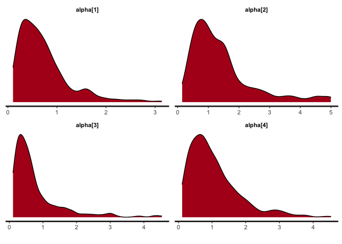

<!-- README.md is generated from README.Rmd. Please edit that file -->

# fcscoring

The fscoring package is designed to implement Bayesian estimation of the
Generalized Thurstonian Unfolding Model (GTUM; paper under review) that
can be seen as an unfolding version of the Thurstonian Item Response
Theory (TIRT; Brown & Maydeu-Olivares, 2011). The TIRT model assumes a
dominance response process that may not be the most appropriate for some
noncognitive tests. Therefore, we developed the GTUM model that adopts
an unfolding response process, which has been shown to better describe
how people respond to noncognitive items (see Roberts, Donoghue, &
Laughlin \[2000\] for the distinction between dominance vs. unfolding
response processes). Although there have been several unfolding forced
choice models, they are limited to specific types of forced choice test
designs (e.g., dichotomous choice, pairs, rank, unidimensional blocks).
The GTUM was intended to be as flexible as the TIRT model so that it can
work with any block size, any response format (e.g., PICK, MOLE, or
RANK; see Cao & Drasgow \[2019\] for details), and any number of
response options (e.g., dichotomous choice vs. graded preference; see
Brown & Maydeu-Olivares \[2018\] for details). Some useful features of
the fscoring function include:

1.  The capacity to deal with missing data in a way similar to how full
    information maximum likelihood works
2.  The capacity to handle high-dimensional structure (e.g., 30 latent
    traits).
3.  Functions for results extraction and Bayesian diagnostic plotting.

Users should be aware of the long computation time (hours) due to the
use of the Bayesian estimator. The backend estimation engine was stan
(Carpenter et al., 2017).

Brown, A., & Maydeu-Olivares, A. (2011). Item response modeling of
forced-choice questionnaires. Educational and Psychological Measurement,
71(3), 460-502.

Brown, A., & Maydeu-Olivares, A. (2018). Ordinal factor analysis of
graded-preference questionnaire data. Structural Equation Modeling: A
Multidisciplinary Journal, 25(4), 516-529.

Cao, M., & Drasgow, F. (2019). Does forcing reduce faking? A
meta-analytic review of forced-choice personality measures in
high-stakes situations. Journal of Applied Psychology, 104(11),
1347–1368.

Carpenter, B., Gelman, A., Hoffman, M. D., Lee, D., Goodrich, B.,
Betancourt, M., … & Riddell, A. (2017). Stan: A probabilistic
programming language. Journal of Statistical Software, 76(1).

Roberts, J. S., Donoghue, J. R., & Laughlin, J. E. (2000). A general
item response theory model for unfolding unidimensional polytomous
responses. Applied Psychological Measurement, 24(1), 3-32.

## Installation

You can install the development version of fcscoring from GitHub:

``` r
devtools::install_github("Naidantu/fcscoring")
```

## Example

**Example 1. dichotomous forced choice pairs**

``` r
library(fcscoring)

## Step 1: Read data
# 1.1 Response data in wide format for a 60-statement forced choice test measuring 5 trait from 50 respondents
gtum.Data <- response
#first 10 respondents' response
gtum.Data[1:10,]
#>       [,1] [,2] [,3] [,4] [,5] [,6] [,7] [,8] [,9] [,10] [,11] [,12] [,13]
#>  [1,]    2    1    2    1    1    2    2    2    2     1     2     1     2
#>  [2,]    2    1    2    2    2    1    2    2    1     2     2     1     1
#>  [3,]    2    1    1    2    1    2    2    2    2     2     2     2     2
#>  [4,]    2    2    1    2    1    1    2    1    1     1     1     1     2
#>  [5,]    1    2    2    2    1    1    2    2    2     1     2     2     1
#>  [6,]    1    1    2    2    1    2    2    2    1     1     2     2     2
#>  [7,]    1    1    2    2    1    1    2    2    1     1     2     1     2
#>  [8,]    1    1    1    2    2    1    2    2    1     2     1     2     2
#>  [9,]    2    1    2    2    1    2    2    2    2     2     2     1     1
#> [10,]    2    2    1    1    1    1    2    2    1     2     2     2     1
#>       [,14] [,15] [,16] [,17] [,18] [,19] [,20] [,21] [,22] [,23] [,24] [,25]
#>  [1,]     2     2     1     1     2     2     2     2     2     1     1     1
#>  [2,]     2     2     1     2     2     2     1     2     1     2     2     1
#>  [3,]     1     2     2     2     1     1     2     2     2     1     2     2
#>  [4,]     2     2     1     1     2     1     1     2     2     2     2     2
#>  [5,]     2     1     2     2     2     2     2     1     2     2     2     1
#>  [6,]     2     2     2     1     1     1     2     1     2     2     2     2
#>  [7,]     2     2     2     1     1     1     1     1     1     2     2     1
#>  [8,]     2     2     2     2     1     2     1     1     1     2     2     1
#>  [9,]     2     1     2     1     2     2     1     2     1     2     1     1
#> [10,]     1     1     1     2     2     1     2     1     1     1     2     2
#>       [,26] [,27] [,28] [,29] [,30]
#>  [1,]     1     1     2     2     1
#>  [2,]     1     2     1     2     2
#>  [3,]     1     2     2     2     2
#>  [4,]     1     2     1     2     1
#>  [5,]     1     2     2     2     2
#>  [6,]     2     2     1     2     2
#>  [7,]     1     2     1     1     2
#>  [8,]     1     2     1     2     2
#>  [9,]     1     2     1     1     2
#> [10,]     2     1     2     1     2

# 1.2 A two-column matrix mapping each statement to each trait. 
# The first row [1,2] means that the first statement in the first pair measures trait 1 and the second statement measures trait 2;
# Similarly, the second row [1,3] means that the first statement in the second pair measures trait 1 and the second statement measures trait 3.
# Please note that the number of rows in "ind" equals the total number of pairs. 
ind <- data.frame(statement1 = c(rep(1,6),rep(2,6),rep(3,6),rep(4,6),rep(5,6)),
                          statement2 = c(2,3,2,5,3,4,
                                         3,1,5,4,3,4,
                                         5,4,4,5,2,1,
                                         1,5,2,5,1,3,
                                         2,2,4,1,1,3))
ind
#>    statement1 statement2
#> 1           1          2
#> 2           1          3
#> 3           1          2
#> 4           1          5
#> 5           1          3
#> 6           1          4
#> 7           2          3
#> 8           2          1
#> 9           2          5
#> 10          2          4
#> 11          2          3
#> 12          2          4
#> 13          3          5
#> 14          3          4
#> 15          3          4
#> 16          3          5
#> 17          3          2
#> 18          3          1
#> 19          4          1
#> 20          4          5
#> 21          4          2
#> 22          4          5
#> 23          4          1
#> 24          4          3
#> 25          5          2
#> 26          5          2
#> 27          5          4
#> 28          5          1
#> 29          5          1
#> 30          5          3

# 1.3 A two-column matrix containing initial values for the statement parameters alpha and delta block by block. 
# 1 for alphas is recommended and -1/-2 or 1/2 for deltas are recommended depending on the signs of the statements.
ParInits <- matrix(c(rep(1,60), rep(c(-1,-1,-1,-1,-1,-1,1,1,1,1,1,1), 5)), ncol = 2)
ParInits
#>       [,1] [,2]
#>  [1,]    1   -1
#>  [2,]    1   -1
#>  [3,]    1   -1
#>  [4,]    1   -1
#>  [5,]    1   -1
#>  [6,]    1   -1
#>  [7,]    1    1
#>  [8,]    1    1
#>  [9,]    1    1
#> [10,]    1    1
#> [11,]    1    1
#> [12,]    1    1
#> [13,]    1   -1
#> [14,]    1   -1
#> [15,]    1   -1
#> [16,]    1   -1
#> [17,]    1   -1
#> [18,]    1   -1
#> [19,]    1    1
#> [20,]    1    1
#> [21,]    1    1
#> [22,]    1    1
#> [23,]    1    1
#> [24,]    1    1
#> [25,]    1   -1
#> [26,]    1   -1
#> [27,]    1   -1
#> [28,]    1   -1
#> [29,]    1   -1
#> [30,]    1   -1
#> [31,]    1    1
#> [32,]    1    1
#> [33,]    1    1
#> [34,]    1    1
#> [35,]    1    1
#> [36,]    1    1
#> [37,]    1   -1
#> [38,]    1   -1
#> [39,]    1   -1
#> [40,]    1   -1
#> [41,]    1   -1
#> [42,]    1   -1
#> [43,]    1    1
#> [44,]    1    1
#> [45,]    1    1
#> [46,]    1    1
#> [47,]    1    1
#> [48,]    1    1
#> [49,]    1   -1
#> [50,]    1   -1
#> [51,]    1   -1
#> [52,]    1   -1
#> [53,]    1   -1
#> [54,]    1   -1
#> [55,]    1    1
#> [56,]    1    1
#> [57,]    1    1
#> [58,]    1    1
#> [59,]    1    1
#> [60,]    1    1

## Step 2: Fit the model
mod <- gtum(gtum.Data=gtum.Data, ind=ind, block=2, ParInits=ParInits, iter=500)

## Step 3: Extract the estimated results 
# 3.1 Extract the theta estimates 
theta <- extract(x=mod, pars='theta')
# Turn the theta estimates into p*trait matrix where p equals sample size and trait equals the number of latent traits
theta <- theta[,1]
# nrow=trait
theta <- matrix(theta, nrow=5)  
theta <- t(theta)
# theta estimates in p*trait matrix format
#first 10 respondents' thetas
theta[1:10,]
#>             [,1]        [,2]        [,3]       [,4]        [,5]
#>  [1,]  0.4798369  0.22388310  0.53104518 -0.3898024  1.59605340
#>  [2,]  0.4789891  0.36200370  0.05882407  0.7023024  0.01434522
#>  [3,]  0.2786368  0.04353014 -0.20761500 -0.5725604  0.28427853
#>  [4,] -0.9217274  0.14325478  0.29172933  0.7681514 -0.82678123
#>  [5,] -0.4634898 -0.42957701  0.68785053  0.1303828  0.10682410
#>  [6,]  0.1796668  0.18760431 -0.50988690  0.2014782 -0.68375644
#>  [7,]  0.3130694 -0.26120888 -0.41764123  1.0134163 -0.35365378
#>  [8,]  1.1097227 -0.35504680 -0.14899362  0.7719901  0.11410093
#>  [9,]  0.3609680  0.05157313  0.80326355 -0.3232802 -0.22769437
#> [10,] -0.9025806  0.13126069  0.54713094 -0.9143915 -0.30288295
# 3.2 Extract the tau estimates
tau <- extract(x=mod, pars='tau')
tau <- tau[,1]
tau
#>     tau[1,1]     tau[2,1]     tau[3,1]     tau[4,1]     tau[5,1]     tau[6,1] 
#>  0.589049781 -0.370653432 -0.214051644  0.933257760  1.213032434  0.393575257 
#>     tau[7,1]     tau[8,1]     tau[9,1]    tau[10,1]    tau[11,1]    tau[12,1] 
#> -0.065065881 -0.448640487  0.857038233  1.075053487 -0.955345331  0.084638344 
#>    tau[13,1]    tau[14,1]    tau[15,1]    tau[16,1]    tau[17,1]    tau[18,1] 
#> -0.624813944  0.390101338 -0.765079984 -0.115455556  0.401972361 -0.237670256 
#>    tau[19,1]    tau[20,1]    tau[21,1]    tau[22,1]    tau[23,1]    tau[24,1] 
#>  0.930920883 -1.898308899  0.116668385  0.705643078 -0.313324702 -0.282647001 
#>    tau[25,1]    tau[26,1]    tau[27,1]    tau[28,1]    tau[29,1]    tau[30,1] 
#> -0.005873172 -0.208506861  0.052613739 -0.355595599 -2.176441946 -0.819308108
#3.3 Extract the estimates of the correlations among dimensions
cor <- extract(x=mod, pars='cor')

## Step 4: Plottings
# 4.1 Obtain the density plots for alphas of the first four statements
bayesplot(x=mod, pars=paste0("alpha[",1:4,"]"), plot='density', inc_warmup=FALSE)
```



``` r
# 4.2 Obtain the trace plots for alphas of the first four statements
bayesplot(x=mod, pars=paste0("alpha[",1:4,"]"), plot='trace', inc_warmup=FALSE)
```


**Example 2. polytomous forced choice pairs**

``` r
library(fcscoring)

## Step 1: Read data
# 1.1 Response data in wide format for a 60-statement forced choice test measuring 5 trait from 50 respondents
gtum.Data <- response
#first 10 respondents' response
gtum.Data[1:10,]
#>       [,1] [,2] [,3] [,4] [,5] [,6] [,7] [,8] [,9] [,10] [,11] [,12] [,13]
#>  [1,]    3    4    2    1    1    5    4    3    4     3     1     4     5
#>  [2,]    3    1    1    5    4    5    5    5    4     1     3     3     5
#>  [3,]    1    1    3    5    4    5    5    4    4     1     1     1     5
#>  [4,]    1    4    4    5    2    5    3    5    5     3     3     4     3
#>  [5,]    1    3    5    2    3    5    1    2    2     1     2     5     1
#>  [6,]    5    1    4    5    3    5    1    3    3     5     5     2     5
#>  [7,]    1    5    3    5    5    5    3    1    3     1     3     2     5
#>  [8,]    5    4    4    3    1    5    5    2    3     5     2     5     3
#>  [9,]    3    4    1    3    3    3    1    1    5     2     4     2     4
#> [10,]    4    4    2    1    1    3    5    1    3     3     3     3     1
#>       [,14] [,15] [,16] [,17] [,18] [,19] [,20] [,21] [,22] [,23] [,24] [,25]
#>  [1,]     2     2     3     2     3     3     5     5     1     4     4     1
#>  [2,]     3     5     5     3     1     2     4     1     3     3     5     1
#>  [3,]     1     5     5     4     5     5     5     5     2     5     4     2
#>  [4,]     3     2     4     1     4     5     4     5     3     1     1     5
#>  [5,]     1     5     3     5     2     5     3     4     5     4     3     3
#>  [6,]     3     3     5     4     3     5     3     3     3     4     5     2
#>  [7,]     5     2     1     2     1     5     3     1     3     2     3     1
#>  [8,]     2     2     3     1     3     3     3     2     3     4     2     3
#>  [9,]     3     4     3     1     4     4     3     1     3     5     5     3
#> [10,]     1     1     1     3     4     5     1     3     2     5     3     3
#>       [,26] [,27] [,28] [,29] [,30]
#>  [1,]     1     1     5     5     5
#>  [2,]     5     3     3     1     3
#>  [3,]     3     2     4     2     3
#>  [4,]     5     2     1     5     3
#>  [5,]     4     3     5     1     1
#>  [6,]     2     5     5     3     5
#>  [7,]     5     5     3     1     1
#>  [8,]     1     2     4     5     2
#>  [9,]     1     5     3     5     3
#> [10,]     3     3     3     3     3

# 1.2 A two-column matrix mapping each statement to each trait. 
# The first row [1,2] means that the first statement in the first pair measures trait 1 and the second statement measures trait 2;
# Similarly, the second row [1,3] means that the first statement in the second pair measures trait 1 and the second statement measures trait 3.
# Please note that the number of rows in "ind" equals the total number of pairs. 
ind <- data.frame(statement1 = c(rep(1,6),rep(2,6),rep(3,6),rep(4,6),rep(5,6)),
                          statement2 = c(2,3,2,5,3,4,
                                         3,1,5,4,3,4,
                                         5,4,4,5,2,1,
                                         1,5,2,5,1,3,
                                         2,2,4,1,1,3))
ind
#>    statement1 statement2
#> 1           1          2
#> 2           1          3
#> 3           1          2
#> 4           1          5
#> 5           1          3
#> 6           1          4
#> 7           2          3
#> 8           2          1
#> 9           2          5
#> 10          2          4
#> 11          2          3
#> 12          2          4
#> 13          3          5
#> 14          3          4
#> 15          3          4
#> 16          3          5
#> 17          3          2
#> 18          3          1
#> 19          4          1
#> 20          4          5
#> 21          4          2
#> 22          4          5
#> 23          4          1
#> 24          4          3
#> 25          5          2
#> 26          5          2
#> 27          5          4
#> 28          5          1
#> 29          5          1
#> 30          5          3

# 1.3 A two-column matrix containing initial values for the statement parameters alpha and delta block by block. 
# 1 for alphas is recommended and -1/-2 or 1/2 for deltas are recommended depending on the signs of the statements.
ParInits <- matrix(c(rep(1,60), rep(c(-1,-1,-1,-1,-1,-1,1,1,1,1,1,1), 5)), ncol = 2)
ParInits
#>       [,1] [,2]
#>  [1,]    1   -1
#>  [2,]    1   -1
#>  [3,]    1   -1
#>  [4,]    1   -1
#>  [5,]    1   -1
#>  [6,]    1   -1
#>  [7,]    1    1
#>  [8,]    1    1
#>  [9,]    1    1
#> [10,]    1    1
#> [11,]    1    1
#> [12,]    1    1
#> [13,]    1   -1
#> [14,]    1   -1
#> [15,]    1   -1
#> [16,]    1   -1
#> [17,]    1   -1
#> [18,]    1   -1
#> [19,]    1    1
#> [20,]    1    1
#> [21,]    1    1
#> [22,]    1    1
#> [23,]    1    1
#> [24,]    1    1
#> [25,]    1   -1
#> [26,]    1   -1
#> [27,]    1   -1
#> [28,]    1   -1
#> [29,]    1   -1
#> [30,]    1   -1
#> [31,]    1    1
#> [32,]    1    1
#> [33,]    1    1
#> [34,]    1    1
#> [35,]    1    1
#> [36,]    1    1
#> [37,]    1   -1
#> [38,]    1   -1
#> [39,]    1   -1
#> [40,]    1   -1
#> [41,]    1   -1
#> [42,]    1   -1
#> [43,]    1    1
#> [44,]    1    1
#> [45,]    1    1
#> [46,]    1    1
#> [47,]    1    1
#> [48,]    1    1
#> [49,]    1   -1
#> [50,]    1   -1
#> [51,]    1   -1
#> [52,]    1   -1
#> [53,]    1   -1
#> [54,]    1   -1
#> [55,]    1    1
#> [56,]    1    1
#> [57,]    1    1
#> [58,]    1    1
#> [59,]    1    1
#> [60,]    1    1

## Step 2: Fit the model
mod <- gtum(gtum.Data=gtum.Data, ind=ind, block=2, ParInits=ParInits, iter=500)

## Step 3: Extract the estimated results 
# 3.1 Extract the theta estimates 
theta <- extract(x=mod, pars='theta')
# Turn the theta estimates into p*trait matrix where p equals sample size and trait equals the number of latent traits
theta <- theta[,1]
# nrow=trait
theta <- matrix(theta, nrow=5)  
theta <- t(theta)
# theta estimates in p*trait matrix format
#first 10 respondents' thetas
theta[1:10,]
#>              [,1]        [,2]       [,3]        [,4]       [,5]
#>  [1,] -1.07966101 -0.59010556  0.1406257 -0.77715683  1.5335144
#>  [2,]  0.89526315 -0.92149207 -0.5130182  0.72901642  0.1422858
#>  [3,]  0.80101602 -1.08500176  0.2638946 -0.06766497  1.0172078
#>  [4,]  0.67928456 -0.41186482  0.7744336 -1.29145529  0.1574511
#>  [5,]  0.13102488 -0.21382113  0.4373080 -0.26453038 -0.9286892
#>  [6,]  0.02910518  0.48718520 -0.8501677  0.03344209  0.4335860
#>  [7,]  0.49579379 -0.80172703 -0.4933050 -0.40440850 -0.4003853
#>  [8,] -1.00508780  0.23629652  0.7045858 -0.99163153  0.2011338
#>  [9,] -0.98048605 -0.06938520 -0.6342752  0.66161847  0.2808004
#> [10,] -0.90662788  0.07651944  1.4897772  0.03851915 -0.1359523
# 3.2 Extract the tau estimates
tau <- extract(x=mod, pars='tau')
tau <- tau[,1]
# nrow=response option-1
tau <- matrix(tau, nrow=4)  
tau <- t(tau)
tau
#>             [,1]        [,2]        [,3]      [,4]
#>  [1,] -1.6429426 -1.22537802  1.30088123 2.3999390
#>  [2,] -0.9596957 -0.38369780  0.65218221 2.5243470
#>  [3,] -2.2279639 -1.24675834  0.38412837 2.1397693
#>  [4,] -2.2176673 -1.09845189  0.16714608 0.8985415
#>  [5,] -1.8612614 -0.82577866  0.54235731 2.2105133
#>  [6,] -4.5488491 -0.78145107  1.27830603 2.3876777
#>  [7,] -2.4178202 -1.49171192  0.62095614 1.5036768
#>  [8,] -1.6154612 -0.82286924  1.67838261 2.1583182
#>  [9,] -2.5129324 -0.90376341  0.58276494 2.3912836
#> [10,] -1.5294580 -0.64837613  1.32131471 1.5993641
#> [11,] -1.8683152 -1.08514348  1.26514914 1.9683308
#> [12,] -1.3914149  0.03514570  1.39156943 2.5762875
#> [13,] -2.3911884 -1.46780012  0.55195135 1.2555740
#> [14,] -1.9755396 -0.93918721  0.88324741 1.3280278
#> [15,] -2.5069506 -1.27320223  0.62407124 1.4634038
#> [16,] -2.2875387 -0.99516457  0.59097552 1.2297422
#> [17,] -1.0903510 -0.26213402  1.16177597 2.1289472
#> [18,] -2.1758692 -1.07340249  0.56472882 1.0496333
#> [19,] -2.6887896 -1.43456797 -0.48016987 0.7254839
#> [20,] -2.3663454 -1.37211980  1.63616676 2.8936355
#> [21,] -1.5273135 -0.96280672  0.18215191 1.1042906
#> [22,] -2.2925972 -1.22389053  1.23762302 2.5848599
#> [23,] -1.7620640 -1.30508319  0.69820549 1.3626956
#> [24,] -2.4290530 -1.34824762  1.29601554 1.9844301
#> [25,] -2.1093493 -1.02657992  1.26039648 1.6664953
#> [26,] -1.9123442 -0.90103234  0.70840844 1.7793636
#> [27,] -2.0902985 -1.22817731  0.53883509 1.4080475
#> [28,] -1.4459435 -0.58944132  0.80627432 1.5254901
#> [29,] -1.0951585 -0.02426054  1.33776123 1.7394515
#> [30,] -2.7205206 -1.48307418 -0.08067894 0.6106860
#3.3 Extract the estimates of the correlations among dimensions
cor <- extract(x=mod, pars='cor')

## Step 4: Plottings
# 4.1 Obtain the density plots for alphas of the first four statements
bayesplot(x=mod, pars=paste0("alpha[",1:4,"]"), plot='density', inc_warmup=FALSE)
```


``` r
# 4.2 Obtain the trace plots for alphas of the first four statements
bayesplot(x=mod, pars=paste0("alpha[",1:4,"]"), plot='trace', inc_warmup=FALSE)
```


**Example 3. dichotomous forced choice triplets recoded into pairs**

``` r
library(fcscoring)

## Step 1: Read data
# 1.1 Response data in wide format for a 60-statement forced choice test measuring 5 trait from 50 respondents
gtum.Data <- response
#first 10 respondents' response
gtum.Data[1:10,]
#>       [,1] [,2] [,3] [,4] [,5] [,6] [,7] [,8] [,9] [,10] [,11] [,12] [,13]
#>  [1,]    1    1    2    2    1    2    2    1    1     2     1     2     2
#>  [2,]    1    2    1    1    1    2    1    1    1     2     2     2     1
#>  [3,]    2    2    1    2    1    1    2    1    2     1     1     2     2
#>  [4,]    1    2    1    2    2    1    1    1    1     2     1     2     1
#>  [5,]    2    2    2    2    1    1    2    1    2     2     1     1     1
#>  [6,]    1    2    2    1    1    2    2    1    1     2     2     2     2
#>  [7,]    1    1    1    2    2    2    2    1    2     1     1     2     2
#>  [8,]    1    2    1    2    2    1    1    1    1     2     1     1     1
#>  [9,]    1    1    1    2    1    1    1    2    1     1     1     2     2
#> [10,]    2    2    1    2    1    2    2    1    1     2     1     1     1
#>       [,14] [,15] [,16] [,17] [,18] [,19] [,20] [,21] [,22] [,23] [,24] [,25]
#>  [1,]     2     1     2     1     1     2     1     1     2     1     2     2
#>  [2,]     1     1     1     2     2     2     2     1     1     1     2     1
#>  [3,]     2     1     2     2     2     1     2     1     2     1     2     1
#>  [4,]     2     1     1     1     2     1     2     1     1     1     2     2
#>  [5,]     1     1     2     2     2     2     2     1     2     1     2     2
#>  [6,]     2     2     1     1     1     2     2     1     1     1     2     2
#>  [7,]     1     1     1     1     2     2     1     1     1     1     1     2
#>  [8,]     1     1     2     1     2     2     2     2     2     1     1     2
#>  [9,]     2     1     2     2     2     2     2     1     1     1     1     2
#> [10,]     1     2     1     1     1     2     2     1     1     1     2     2
#>       [,26] [,27] [,28] [,29] [,30] [,31] [,32] [,33] [,34] [,35] [,36] [,37]
#>  [1,]     1     2     2     2     2     1     1     1     1     1     1     2
#>  [2,]     2     2     1     1     1     2     1     2     1     2     1     1
#>  [3,]     2     1     1     2     1     2     2     2     1     2     2     2
#>  [4,]     2     2     1     1     1     1     2     2     1     1     1     2
#>  [5,]     2     2     2     1     1     2     2     2     2     2     1     2
#>  [6,]     1     1     1     1     1     2     2     1     1     1     1     2
#>  [7,]     1     1     2     2     1     2     2     2     1     1     2     2
#>  [8,]     2     2     1     2     1     1     1     2     1     1     1     2
#>  [9,]     1     1     2     1     1     2     2     2     1     1     1     1
#> [10,]     1     1     1     1     2     1     1     2     1     2     2     2
#>       [,38] [,39] [,40] [,41] [,42] [,43] [,44] [,45] [,46] [,47] [,48] [,49]
#>  [1,]     2     1     2     1     1     2     1     2     2     2     2     2
#>  [2,]     2     1     1     1     1     1     2     1     1     1     2     1
#>  [3,]     1     1     2     2     1     1     1     2     2     2     2     1
#>  [4,]     1     2     2     1     2     1     1     2     1     1     1     1
#>  [5,]     2     2     1     1     2     1     2     2     1     1     2     1
#>  [6,]     2     2     2     1     1     1     2     1     1     1     2     1
#>  [7,]     1     1     1     1     2     1     2     1     2     2     2     2
#>  [8,]     2     2     1     2     2     1     1     1     1     1     1     1
#>  [9,]     1     1     1     1     2     1     1     1     1     2     2     2
#> [10,]     1     1     1     1     2     1     2     2     2     1     2     2
#>       [,50] [,51] [,52] [,53] [,54] [,55] [,56] [,57] [,58] [,59] [,60]
#>  [1,]     1     1     1     1     1     2     2     2     2     1     1
#>  [2,]     1     2     1     1     1     1     1     1     2     1     2
#>  [3,]     1     1     1     1     1     1     2     2     1     2     1
#>  [4,]     1     1     1     1     1     1     2     2     2     2     1
#>  [5,]     1     2     2     1     1     1     1     2     1     1     1
#>  [6,]     1     1     2     1     1     2     2     2     1     1     1
#>  [7,]     1     1     2     1     1     2     1     1     2     1     1
#>  [8,]     1     1     2     1     1     2     1     1     1     2     1
#>  [9,]     2     1     2     2     1     1     1     2     1     1     2
#> [10,]     1     1     1     1     2     1     2     2     2     1     1

# 1.2 A two-column matrix mapping each statement to each trait in the recoded pairs
# The first row [1,2] means that the first statement in the first pair measures trait 1 and the second statement measures trait 2;
# Similarly, the second row [1,3] means that the first statement in the second pair measures trait 1 and the second statement measures trait 3.
# Please note that the number of rows in "ind" equals the total number of pairs. 
ind <- data.frame(dim.1 = c(1,1,2,3,3,4,5,5,2,4,4,5,3,3,1,5,5,2,2,2,1,4,4,5,5,5,1,4,4,1,2,2,3,1,1,3,2,2,1,3,3,4,2,2,5,4,4,1,4,4,3,3,3,2,5,5,4,4,4,3),
                  dim.2 = c(2,5,5,4,1,1,2,3,3,5,1,1,1,2,2,2,4,4,1,3,3,5,2,2,1,3,3,1,2,2,3,4,4,3,5,5,1,4,4,4,5,5,5,1,1,1,3,3,3,5,5,2,5,5,4,1,1,3,2,2))
ind
#>    dim.1 dim.2
#> 1      1     2
#> 2      1     5
#> 3      2     5
#> 4      3     4
#> 5      3     1
#> 6      4     1
#> 7      5     2
#> 8      5     3
#> 9      2     3
#> 10     4     5
#> 11     4     1
#> 12     5     1
#> 13     3     1
#> 14     3     2
#> 15     1     2
#> 16     5     2
#> 17     5     4
#> 18     2     4
#> 19     2     1
#> 20     2     3
#> 21     1     3
#> 22     4     5
#> 23     4     2
#> 24     5     2
#> 25     5     1
#> 26     5     3
#> 27     1     3
#> 28     4     1
#> 29     4     2
#> 30     1     2
#> 31     2     3
#> 32     2     4
#> 33     3     4
#> 34     1     3
#> 35     1     5
#> 36     3     5
#> 37     2     1
#> 38     2     4
#> 39     1     4
#> 40     3     4
#> 41     3     5
#> 42     4     5
#> 43     2     5
#> 44     2     1
#> 45     5     1
#> 46     4     1
#> 47     4     3
#> 48     1     3
#> 49     4     3
#> 50     4     5
#> 51     3     5
#> 52     3     2
#> 53     3     5
#> 54     2     5
#> 55     5     4
#> 56     5     1
#> 57     4     1
#> 58     4     3
#> 59     4     2
#> 60     3     2

# 1.3 A two-column matrix containing initial values for the statement parameters alpha and delta block by block. 
# 1 for alphas is recommended and -1/-2 or 1/2 for deltas are recommended depending on the signs of the statements.
ParInits <- matrix(c(rep(1,60), c(rep(-1,30),rep(1,30))), ncol = 2)
ParInits
#>       [,1] [,2]
#>  [1,]    1   -1
#>  [2,]    1   -1
#>  [3,]    1   -1
#>  [4,]    1   -1
#>  [5,]    1   -1
#>  [6,]    1   -1
#>  [7,]    1   -1
#>  [8,]    1   -1
#>  [9,]    1   -1
#> [10,]    1   -1
#> [11,]    1   -1
#> [12,]    1   -1
#> [13,]    1   -1
#> [14,]    1   -1
#> [15,]    1   -1
#> [16,]    1   -1
#> [17,]    1   -1
#> [18,]    1   -1
#> [19,]    1   -1
#> [20,]    1   -1
#> [21,]    1   -1
#> [22,]    1   -1
#> [23,]    1   -1
#> [24,]    1   -1
#> [25,]    1   -1
#> [26,]    1   -1
#> [27,]    1   -1
#> [28,]    1   -1
#> [29,]    1   -1
#> [30,]    1   -1
#> [31,]    1    1
#> [32,]    1    1
#> [33,]    1    1
#> [34,]    1    1
#> [35,]    1    1
#> [36,]    1    1
#> [37,]    1    1
#> [38,]    1    1
#> [39,]    1    1
#> [40,]    1    1
#> [41,]    1    1
#> [42,]    1    1
#> [43,]    1    1
#> [44,]    1    1
#> [45,]    1    1
#> [46,]    1    1
#> [47,]    1    1
#> [48,]    1    1
#> [49,]    1    1
#> [50,]    1    1
#> [51,]    1    1
#> [52,]    1    1
#> [53,]    1    1
#> [54,]    1    1
#> [55,]    1    1
#> [56,]    1    1
#> [57,]    1    1
#> [58,]    1    1
#> [59,]    1    1
#> [60,]    1    1

# Please note that if the original test format is triplets, a pairmap file that specifies the rank/ID of the statement in each trait it measures for the recoded pair format. For example, suppose there are 3 statements measuring each trait. 1 means the statement is the first statement measuring the trait and 3 means the statement is the last statement measuring the trait.

# 1.4 A two-column matrix specifying the ID of statements within each trait. The row of this matrix equals to the total number of pairwise comparisons. 
pairmap <- data.frame(ino.1 = c(1,1,1,1,1,1,2,2,2,2,2,3,3,3,4,4,4,4,5,5,5,4,4,5,6,6,6,5,5,7,8,8,6,8,8,7,9,9,9,8,8,8,10,10,9,9,9,11,10,10,10,11,11,11,12,12,11,12,12,12),
                        ino.2 = c(1,1,1,1,2,2,2,2,2,3,3,3,4,3,3,4,3,3,5,4,4,5,6,6,6,5,5,7,7,7,6,6,6,7,7,7,9,7,7,8,8,8,9,10,10,11,9,9,10,10,10,11,11,11,11,12,12,12,12,12))
pairmap
#>    ino.1 ino.2
#> 1      1     1
#> 2      1     1
#> 3      1     1
#> 4      1     1
#> 5      1     2
#> 6      1     2
#> 7      2     2
#> 8      2     2
#> 9      2     2
#> 10     2     3
#> 11     2     3
#> 12     3     3
#> 13     3     4
#> 14     3     3
#> 15     4     3
#> 16     4     4
#> 17     4     3
#> 18     4     3
#> 19     5     5
#> 20     5     4
#> 21     5     4
#> 22     4     5
#> 23     4     6
#> 24     5     6
#> 25     6     6
#> 26     6     5
#> 27     6     5
#> 28     5     7
#> 29     5     7
#> 30     7     7
#> 31     8     6
#> 32     8     6
#> 33     6     6
#> 34     8     7
#> 35     8     7
#> 36     7     7
#> 37     9     9
#> 38     9     7
#> 39     9     7
#> 40     8     8
#> 41     8     8
#> 42     8     8
#> 43    10     9
#> 44    10    10
#> 45     9    10
#> 46     9    11
#> 47     9     9
#> 48    11     9
#> 49    10    10
#> 50    10    10
#> 51    10    10
#> 52    11    11
#> 53    11    11
#> 54    11    11
#> 55    12    11
#> 56    12    12
#> 57    11    12
#> 58    12    12
#> 59    12    12
#> 60    12    12

## Step 2: Fit the model
mod <- gtum(gtum.Data=gtum.Data, ind=ind, block=3, ParInits=ParInits, pairmap=pairmap, iter=500)

## Step 3: Extract the estimated results 
# 3.1 Extract the theta estimates 
theta <- extract(x=mod, pars='theta')
# Turn the theta estimates into p*trait matrix where p equals sample size and trait equals the number of latent traits
theta <- theta[,1]
# nrow=trait
theta <- matrix(theta, nrow=5)  
theta <- t(theta)
# theta estimates in p*trait matrix format
#first 10 respondents' thetas
theta[1:10,]
#>             [,1]        [,2]        [,3]       [,4]        [,5]
#>  [1,]  0.8945660  0.92914083 -0.79030113 -0.2084456  0.67733590
#>  [2,]  0.5297997  0.01060502  0.74544378 -1.0968782  0.25768795
#>  [3,] -0.6532731  0.10179067 -0.05212892  0.5956760  0.02982081
#>  [4,] -0.1991998  0.01704564 -0.03979748  0.5924355  0.58745897
#>  [5,]  0.1562542 -0.17389118  0.98914479 -0.3602631  0.38957287
#>  [6,]  1.0379226  0.94833766 -0.18134227 -1.5720463  0.84725216
#>  [7,]  1.9319945 -0.43126031 -0.53109571  0.4925765  0.39503036
#>  [8,]  0.1882837 -0.22869024  0.62856816 -0.5450758  0.78104537
#>  [9,]  1.2867854 -1.63576442 -0.49847446  1.3708479 -1.06191123
#> [10,] -1.8921971  1.10546704 -0.13137360  0.1752951  0.23316869
# 3.2 Extract the tau estimates
tau <- extract(x=mod, pars='tau')
tau <- tau[,1]
tau
#>    tau[1,1]    tau[2,1]    tau[3,1]    tau[4,1]    tau[5,1]    tau[6,1] 
#>  0.06284373 -0.62471590  3.78678538 -1.36503186 -0.01914395 -0.53216449 
#>    tau[7,1]    tau[8,1]    tau[9,1]   tau[10,1]   tau[11,1]   tau[12,1] 
#> -1.72272490  0.45446404 -0.83416124 -1.91397293  2.23500063  0.43115582 
#>   tau[13,1]   tau[14,1]   tau[15,1]   tau[16,1]   tau[17,1]   tau[18,1] 
#>  0.28418114  0.11477104  0.97357585 -1.29677944 -1.15545512 -0.98780689 
#>   tau[19,1]   tau[20,1]   tau[21,1]   tau[22,1]   tau[23,1]   tau[24,1] 
#>  2.94812286 -1.66194171  1.19032539  0.01661993  1.20414101  0.25882225 
#>   tau[25,1]   tau[26,1]   tau[27,1]   tau[28,1]   tau[29,1]   tau[30,1] 
#>  0.79107075  1.12472445 -1.04828198  0.30719670 -0.26865821  0.06939624 
#>   tau[31,1]   tau[32,1]   tau[33,1]   tau[34,1]   tau[35,1]   tau[36,1] 
#>  0.19150915  0.39668061 -0.92417533  1.87582057  0.68156408  0.65447625 
#>   tau[37,1]   tau[38,1]   tau[39,1]   tau[40,1]   tau[41,1]   tau[42,1] 
#> -1.31220296 -0.64964569  0.64281609  0.62292668  2.04976541 -0.51866371 
#>   tau[43,1]   tau[44,1]   tau[45,1]   tau[46,1]   tau[47,1]   tau[48,1] 
#>  0.28222292 -1.10041931  0.57336935  0.44281497  0.66375088 -0.51289249 
#>   tau[49,1]   tau[50,1]   tau[51,1]   tau[52,1]   tau[53,1]   tau[54,1] 
#> -1.13403395  1.22190441  1.27074689  0.24857610  2.97319110  1.73008654 
#>   tau[55,1]   tau[56,1]   tau[57,1]   tau[58,1]   tau[59,1]   tau[60,1] 
#>  1.33319985  0.66647201 -0.38099958  1.43235386 -0.33782582  0.57302108
#3.3 Extract the estimates of the correlations among dimensions
cor <- extract(x=mod, pars='cor')

## Step 4: Plottings
# 4.1 Obtain the density plots for alphas of the first four statements
bayesplot(x=mod, pars=paste0("alpha[",1:4,"]"), plot='density', inc_warmup=FALSE)
```


``` r
# 4.2 Obtain the trace plots for alphas of the first four statements
bayesplot(x=mod, pars=paste0("alpha[",1:4,"]"), plot='trace', inc_warmup=FALSE)
```


