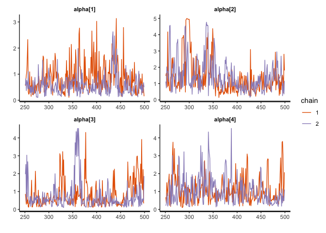

<!-- README.md is generated from README.Rmd. Please edit that file -->

# fcscoring

The goal of fcscoring is to estimate the Generalized Thurstonian
Unfolding Model (GTUM) using Bayesian method. Below are some important
features of the fcscoring package:

1.  Essentially can handle FC scales with any block sizes and any number
    of response options. It is supposed to be as flexible as the
    Thurstonian IRT model.
2.  Automatically deals with missing data in a way similar to how full
    information maximum likelihood handles missing data.
3.  Dimensions are allowed to correlate and the correlations are
    estimated.
4.  Functions (i.e., fcscoring( ), extract( ), and bayesplot( )) are
    provided for model estimation, results extraction, and Bayesian
    diagnostic plottings, respectively.

## Installation

You can install the development version of fcscoring from GitHub:

``` r
devtools::install_github("Naidantu/fcscoring")
```

## Example

This is a basic example which shows you how to prepare data, fit the
model, extract and plot results:

``` r
library(fcscoring)

## basic example code
## Step 1: Input data
# 1.1 Response data in wide format. 
gtum.Data <- c(1,5,2,3,1,2,1,5,3,1,1,1,4,1,4,4,3,2,2,3)
gtum.Data <- matrix(gtum.Data,nrow = 5)
gtum.Data
#>      [,1] [,2] [,3] [,4]
#> [1,]    1    2    1    4
#> [2,]    5    1    1    3
#> [3,]    2    5    4    2
#> [4,]    3    3    1    2
#> [5,]    1    1    4    3

# 1.2 A two-column matrix mapping each statement to each trait. 
# The first row [1,2] means that the first statement in the first pair measures trait 1 and the second statement measures trait 2;
# Similarly, the second row [1,3] means that the first statement in the second pair measures trait 1 and the second statement measures trait 3.
# Please note that the number of rows in "ind" equals the total number of pairs. 
ind <- matrix(c(1, 1, 1, 1, 2, 3, 2, 5), ncol = 2)

# 1.3 A two-column matrix specifying the directions or positivity/negativity of the statements. 
ParInits <- matrix(c(-1, -1, -1, 1, -1, -1, -1, 1), ncol = 2)
ParInits
#>      [,1] [,2]
#> [1,]   -1   -1
#> [2,]   -1   -1
#> [3,]   -1   -1
#> [4,]    1    1

# Please note that if the original test format is triplets, a pairmap file that specifies the rank/ID of the statement in each trait it measures. For example, suppose there are 3 statements measuring each trait. 1 means the statement is the first statement measuring the trait and 3 means the statement is the last statement measuring the trait.

## Step 2: Fit the model
mod <- gtum(gtum.Data=gtum.Data, ind=ind, block=2, ParInits=ParInits, iter=500)

## Step 3: Extract the estimated results 
# 3.1 Extract the theta estimates 
theta <- extract(x=mod, pars='theta')
# Turn the theta estimates into p*trait matrix where p equals sample size and trait equals the number of latent traits
theta <- theta[,1]
# nrow=trait
theta <- matrix(theta, nrow=5)  
theta <- t(theta)
# theta estimates in p*trait matrix format
theta
#>            [,1]        [,2]        [,3]         [,4]        [,5]
#> [1,]  0.7478349 -0.38528618  0.04534792  0.010632627 -0.20591914
#> [2,]  0.2195263  0.17604277 -0.45792966  0.031986314  0.01188985
#> [3,] -0.8979373 -0.06043326  0.44338136 -0.007792788  0.18598106
#> [4,] -0.3933926 -0.33924838  0.03301785 -0.041585293  0.28406572
#> [5,]  0.2482186  0.06574026 -0.40831783  0.017887884  0.02689652
# 3.2 Extract the tau estimates
tau <- extract(x=mod, pars='tau')
tau <- tau[,1]
tau
#>     tau[1,1]     tau[1,2]     tau[1,3]     tau[1,4]     tau[2,1]     tau[2,2] 
#> -1.513455258 -0.272633139  0.897202140  1.646161917 -1.772293979 -0.457921696 
#>     tau[2,3]     tau[2,4]     tau[3,1]     tau[3,2]     tau[3,3]     tau[3,4] 
#>  0.900091268  1.723338476 -1.101591746 -0.515351597  0.008186277  2.555420143 
#>     tau[4,1]     tau[4,2]     tau[4,3]     tau[4,4] 
#> -3.199469744 -0.692772699  1.118176371  2.978266806
#3.3 Extract the estimates of the correlations among dimensions
cor <- extract(x=mod, pars='cor')

## Step 4: Plottings
# 4.1 Obtain the density plots for alpha
bayesplot(x=mod, pars='alpha', plot='density', inc_warmup=FALSE)
```


``` r
# 4.2 Obtain the trace plots for alpha
bayesplot(x=mod, pars='alpha', plot='trace', inc_warmup=FALSE)
```


